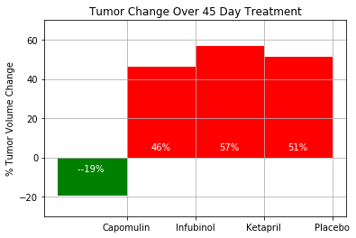
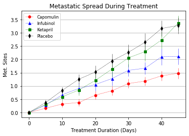
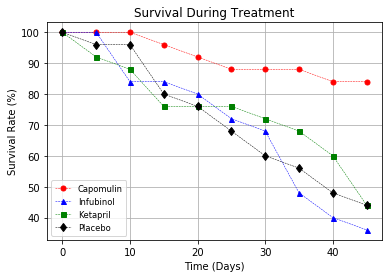

# Pharmaceutical_Study-Matplotlib-Pandas
 
 In this study, 250 mice were treated through a variety of drug regimes over the course of 45 days. 
- Their physiological responses were then monitored over the course of that time. 
- The objective is to analyze and compate  the data to show how four treatments (Capomulin, Infubinol, Ketapril, and Placebo)  using python, pandas and matplotlib.

###Created: 
 - Scatter plot that shows how the tumor volume changes over time for each treatment.
 - Scatter plot that shows how the number of [metastatic](https://en.wikipedia.org/wiki/Metastasis) 
 	(cancer spreading) sites changes over time for each treatment.
 - Scatter plot that shows the number of mice still alive through the course of treatment (Survival Rate)
 - Bar graph that compares the total % tumor volume change for each drug across the full 45 days.

* Included 3 observations about the results of the study. Use the visualizations you generated from the study data as the basis for your observations.
* Used the Pandas Library and the Jupyter Notebook, Matplotlib library.

